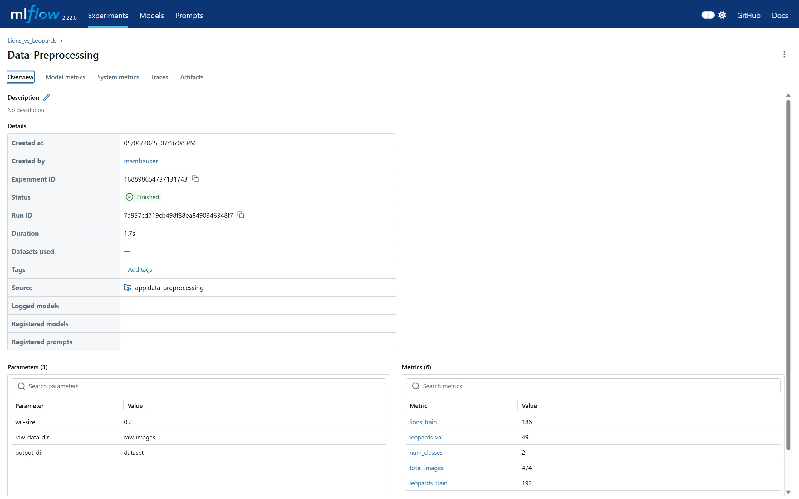

# 🦁Lions vs Leopards: Image Classification Project🐆

Проект по обучению и развёртыванию нейросети для бинарной классификации изображений львов и леопардов. Реализован с использованием MLflow для управления экспериментами и Docker для упаковки и переносимости окружения.

### Жизненный цикл ML-модели `[для чего используется mlflow...]`

Проект реализован как полноценный ML pipeline с поддержкой воспроизводимости, автоматического логирования и деплоя.

Этапы:
1) data-preprocessing — разбиение изображений по классам и train/val.
2) hyperparameters-tuning — поиск гиперпараметров с Optuna.
3) model-training — обучение классификатора на изображениях.
4) model-evaluation — логирование метрик и сравнение.

Благодаря этим этапам все эксперименты полностью отлеживаются (параметры, метрики, аретфакты, модели), можно воспроизвести любой запуск, восстановив точную конфигурацию модели, упрощается сравнение моделей и выбор лучших конфигураций, модель сохраняется в универсальном формате, готовом к деплою и интеграции, например с помощью `mlflow run server`.

### Mlflow UI

Позволяет мониторить результаты работы с приятным и удобным браузерным (а значит и кроссплатформенным) интерфейсом

### Docker

Просто способ изолировать и тем самым упростить развертывание сервиса на любом другом хосте

### Выводы

Использование MLflow и Docker позволило сделать процесс обучения модели полностью воспроизводимым, управляемым и удобным для отслеживания. В результате модель легко масштабируется, повторно обучается с новыми данными и готова к развёртыванию в продакшн без дополнительных изменений кода.