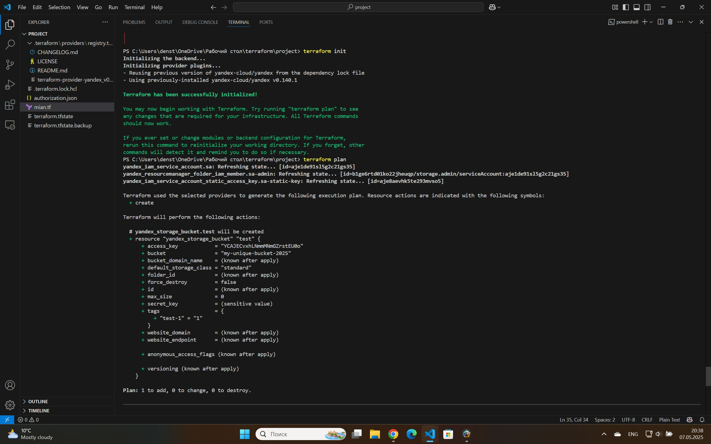
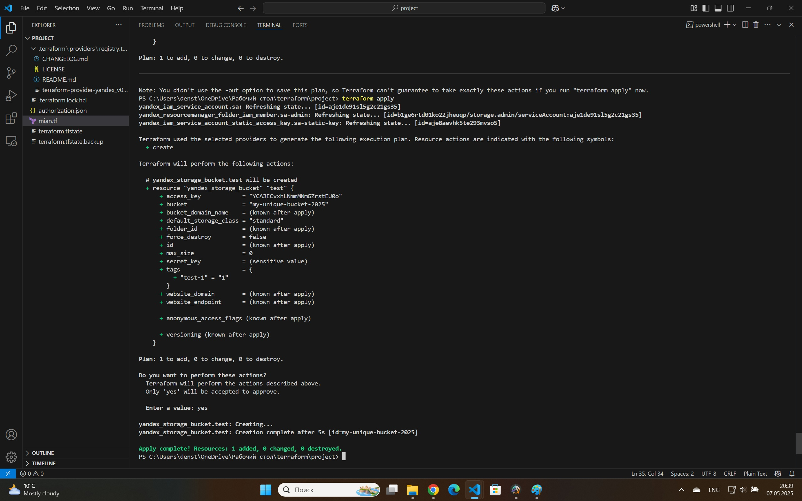

# Terraform Project

Мини проект по созданию бакета с помощью terraform. В нём я создаю сервисный аккаунт, ключи шифрования и создаю S3 бакет

### Ввыводы:

Terraform упрощает создание и управление облачной структуры, так как у тебя есть код, ты его изменяешь по-своему усмотрению, а инструментарий формирует планы по изменению в соответствии с твоим кодом под капотом, выглядит очень удобно